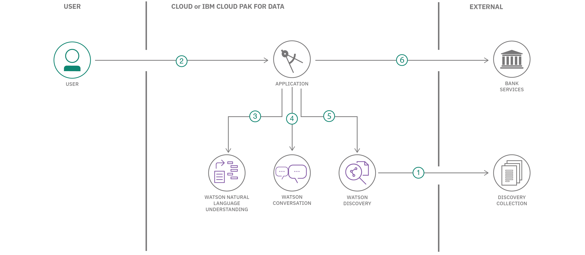
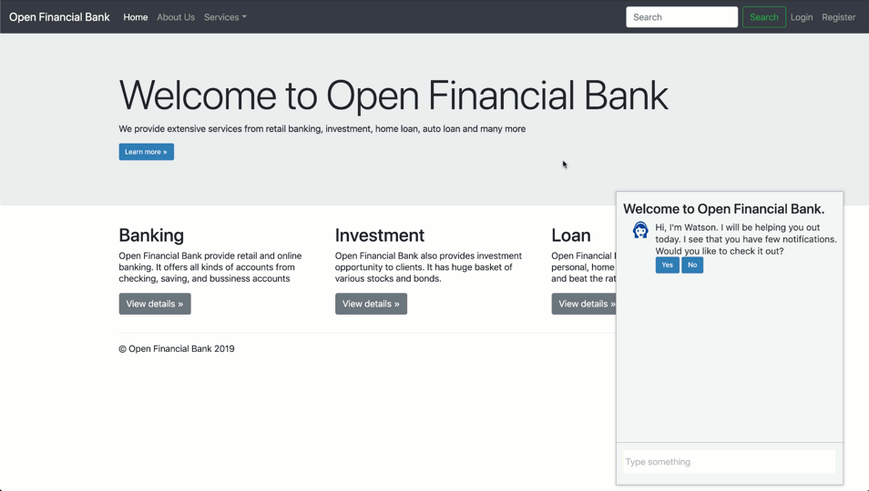
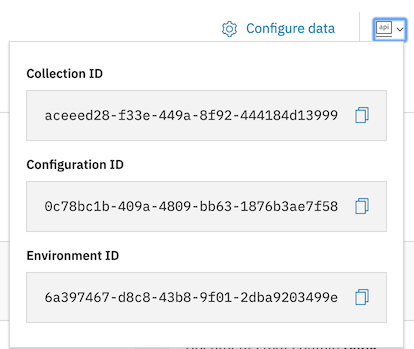

[](https://travis-ci.org/IBM/watson-banking-chatbot)

# Create a banking chatbot with FAQ discovery, anger detection and natural language understanding

In this code pattern, we will create a chatbot using Node.js and Watson Assistant. The Assistant flow will detect customer emotions and be enhanced by using Natural Language Understanding to identify location entities. For FAQs, a call to the Discovery service will use passage retrieval to pull answers from a collection of documents.

When the reader has completed this pattern, they will understand how to:

* Create a chatbot that converses via a web UI using Watson Assistant and Node.js
* Use Watson Discovery with passage retrieval to find answers in FAQ documents
* Identify location entities with Watson Natural Language Understanding

<!-- > **NOTE**: This code pattern has been updated to include instructions for accessing Watson services running on IBM Cloud Pak for Data. These updates can be found in the specific instructions for deploying your app [locally](doc/source/local.md), or deploying your app to [OpenShift on IBM Cloud](doc/source/openshift.md). The main change required is that your application will need additional credentials to access the IBM Cloud Pak for Data cluster that is hosting the Watson services.
>
> Click [here](https://www.ibm.com/products/cloud-pak-for-data) for more information about IBM Cloud Pak for Data. -->



## Flow

1. The FAQ documents are added to the Discovery collection.
1. The user interacts with a chatbot via the app UI.
1. User input is processed with Natural Language Understanding (NLU). The context is enriched with NLU-detected entities and keywords (e.g., a location).
1. The input and enriched context is sent to Assistant. Assistant recognizes intent, entities and dialog paths. It responds with a reply and/or action.
1. Optionally, a requested action is performed by the app. This may include one of the following:
   * Lookup additional information from bank services to append to the reply
   * Use Discovery to reply with an answer from the FAQ documents

## Included components

* [IBM Watson Assistant](https://www.ibm.com/cloud/watson-assistant/): Build, test and deploy a bot or virtual agent across mobile devices, messaging platforms, or even on a physical robot.
* [IBM Watson Discovery](https://www.ibm.com/watson/services/discovery/): A cognitive search and content analytics engine for applications to identify patterns, trends, and actionable insights.
* [IBM Watson Natural Language Understanding](https://www.ibm.com/watson/services/natural-language-understanding/): Analyze text to extract meta-data from content such as concepts, entities, keywords, categories, sentiment, emotion, relations, semantic roles, using natural language understanding.

## Featured technologies

* [Node.js](https://nodejs.org/): An asynchronous event driven JavaScript runtime, designed to build scalable applications.

## Steps

1. [Clone the repo](#1-clone-the-repo)
1. [Create Watson services](#2-create-watson-services)
1. [Deploy the application](#3-deploy-the-application)
1. [Use the web app](#4-use-the-web-app)
1. [Customize the Watson Assistant skill](#5-customize-the-watson-assistant-skill)
1. [Load Discovery documents](#6-load-discovery-documents)

### 1. Clone the repo

Clone the `watson-banking-chatbot` locally. In a terminal, run:

```bash
git clone https://github.com/IraAngeles-IBM/watson-banking-chatbot.git
```

### 2. Create Watson services

Provision the following services:

* **Watson Assistant**
* **Watson Discovery**
* **Watson Natural Language Understanding**

> **NOTE**: If you will be using the `Deploy to Cloud Foundry on IBM Cloud` deployment option, then you can skip this step. That deployment option automatically creates the services and links them to your application.

<!-- The instructions will depend on whether you are provisioning services using IBM Cloud Pak for Data or on IBM Cloud.

Click to expand one: -->

<!-- <details><summary><b>IBM Cloud Pak for Data</b></summary>
<p>
<i>Use the following instructions for each of the three services.</i>
<p>
<h5>Install and provision service instances</h5>
<p>
The services are not available by default. An administrator must install them on the IBM Cloud Pak for Data platform, and you must be given access to the service. To determine whether the service is installed, Click the <b>Services</b> icon () and check whether the service is enabled.
</details> -->

<!-- <details><summary><b>IBM Cloud</b></summary>
<p> -->

IBM Cloud

<h5>Create the service instances</h5>
  <ul>
    <li>If you do not have an IBM Cloud account, register for a free trial account <a href="https://ibm.biz/BdqyTb">here</a>.</li>
    <li>Click <a href="https://cloud.ibm.com/catalog/services/watson-assistant">here</a> to create a <b>Watson Assistant</b> instance.</li>
    <li>Click <a href="https://cloud.ibm.com/catalog/services/discovery">here</a> to create a <b>Discovery</b> instance.</li>
    <li>Click <a href="https://cloud.ibm.com/catalog/services/natural-language-understanding">here</a> to create a <b>Natural Language Understanding</b> instance.</li>
  </ul>
<!-- </details> -->

### 3. Deploy the application

Instructions on deploying the Node.js server.

<!-- Click on one of the options below for instructions on deploying the Node.js server. -->

<!-- | | | |
| :-: | :-: | :-: |
| [](doc/source/local.md) | [](doc/source/openshift.md) | [](doc/source/cf.md) | -->

| | | |
| :-: | :-: | :-: |
| [](docs/doc/source/local.html) | [](docs/doc/source/cf.html) |

### 4. Use the web app

The web app presents a customer service chatbot. Interact with the chatbot by pressing the buttons when prompted or use the `Type something` box. The chatbot is powered by Watson Assistant with additional information coming from Discovery and Natural Language Understanding.



### 5. Customize the Watson Assistant skill

<!-- The following instructions will depend on if you are provisioning Assistant from IBM Cloud or from an IBM Cloud Pak for Data cluster. Click to expand: -->

<!-- <details><summary>Provision on IBM Cloud Pak for Data</summary>
<p>

* Find the Assistant service in your list of `Provisioned Instances` in your IBM Cloud Pak for Data Dashboard.
* Click on `View Details` from the options menu associated with your Assistant service.
* Click on `Open Watson Assistant`.
* Go to the `Skills` tab.
* Click `Create skill`
* Select the `Dialog skill` option and then click `Next`.
* Click the `Import skill` tab.
* Click `Choose JSON file`, go to your cloned repo dir, and `Open` the JSON file in `data/conversation/workspaces/banking_US.json` (or use the old full version in `full_banking.json`). `banking_IN.json` is used for content for banking in India and `banking_US.json` is used for content for banking in United States.
* Select `Everything` and click `Import`.

</p>
</details> -->

<!-- <details><summary>Provision on IBM Cloud</summary>
<p> -->

Provision on IBM Cloud

* Find the Assistant service in your IBM Cloud Dashboard.
* Click on the service and then click on `Launch tool`.
* Go to the `Skills` tab.
* Click `Create skill`.
* Select the `Dialog skill` option and then click `Next`.
* Click the `Import skill` tab.
* Click `Choose JSON file`, go to your cloned repo dir, and `Open` the JSON file in `data/conversation/workspaces/banking_US.json` (or use the old full version in `full_banking.json`). `banking_IN.json` is used for content for banking in India and `banking_US.json` is used for content for banking in United States.
* Select `Everything` and click `Import`.

<!-- </p>
</details> -->

To find the `Skill ID` for Watson Assistant:

* Go back to the `Skills` tab.
* Click on the three dots in the upper right-hand corner of a card and select `View API Details`.
* Copy the `Skill ID` GUID. Use this value when setting up your run-time environment.
* By default the application will import and use the skill named **watson-banking-chatbot**, but you can configure it to use another skill by setting the run-time environment variable `SKILL_ID`.

  

To view the Assistant dialog, click on the skill and choose the
`Dialog` tab. Here's a snippet of the dialog:


### 5. Load Discovery documents

By default, the application will create a collection named **watson-banking-chatbot**, but you can configure it to use another collection by setting the run-time environment variables `DISCOVERY_COLLECTION_ID` and `DISCOVERY_ENVIRONMENT_ID`.

The following instructions will depend on if you are provisioning Discovery from IBM Cloud or from an IBM Cloud Pak for Data cluster. Cick to expand:

<!-- <details><summary>Provision on IBM Cloud Pak for Data</summary>
<p>

* Find the Discovery service in your list of `Provisioned Instances` in your IBM Cloud Pak for Data Dashboard.
* Click on `View Details` from the options menu associated with your Discovery service.
* Click on `Open Watson Discovery`.
* Click on an existing Discovery `Project`, or create a new one.
* From your `Project` panel, click the `Collections` tab.
* Click on `New Collection +`.
* Select the `Upload data` option and click `Next`.
* Provide a collection name.
* Select `English` language.
* Click `Finish` to create the collection.
* Use `Drag and drop your documents here or select documents` to seed the content with the five documents in `data/discovery/docs` of your cloned repo.
* Click on the `Integrate and deploy` option from the left-side menu of the Discovery panel. Then select the `View API Details` tab to view the `Project Id`. Use this as the `Collection ID` value when setting up your run-time environment.

> **NOTE**: The `Environment Id` for Cloud Pak for Data collections is always set to `default`.

  

</p>
</details> -->

<details><summary>Provision on IBM Cloud</summary>
<p>

* Find the Discovery service in your IBM Cloud Dashboard.
* Click on the service and then click on `Launch tool`.
* Create a new data collection by hitting the `Upload your own data` button.

  
  * Provide a collection name
  * Select `English` language
  * Click `Create`

* Use `Drag and drop your documents here or select documents` to seed the content with the five documents in `data/discovery/docs` of your cloned repo.
* Click on the upper-right `api` icon and save the `Environment ID` and `Collection ID` as they will be required when setting up your run-time environment.

  

</p>
</details>

## Troubleshooting

* Error: Unable to list workspaces for Watson Assistant: Forbidden: Access is denied due to invalid credentials.

  > This error occurs with `Deploy to IBM Cloud` button. Configure a runtime environment variable for `ASSISTANT_APIKEY` to allow automatic configuration of the default skill or configure `SKILL_ID` to use another skill.

* Fail: An operation for service instance wbc-discovery-service is in progress.

  > This error occurs when starting the app before the service is ready. It is currently common behavior with the `Deploy to IBM Cloud` button. In this case, click the `Run` button to restart the application. It will succeed when the service is ready.

* Error: Environment {GUID} is still not active, retry once status is active

  > This is common during the first run. The app tries to start before the Discovery environment is fully created. Wait a few minutes and click the `Run` button to restart the application.

* Error: Only one free environment is allowed per organization

  > To work with a free trial, a small free Discovery environment is created. If you already have a Discovery environment, this will fail. If you are not using Discovery, check for an old service thay you may want to delete. Otherwise use the .env DISCOVERY_ENVIRONMENT_ID to tell the app which environment you want it to use. A collection will be created in this environment using the default configuration.

## Links

* [Demo on Youtube](https://www.youtube.com/watch?v=Jxi7U7VOMYg)
* [Watson Node.js SDK](https://github.com/watson-developer-cloud/node-sdk)
* [Relevancy Training Demo Video](https://www.youtube.com/watch?v=8BiuQKPQZJk)
* [Relevancy Training Demo Notebook](https://github.com/akmnua/relevancy_passage_bww)

## License

This code pattern is licensed under the Apache License, Version 2. Separate third-party code objects invoked within this code pattern are licensed by their respective providers pursuant to their own separate licenses. Contributions are subject to the [Developer Certificate of Origin, Version 1.1](https://developercertificate.org/) and the [Apache License, Version 2](https://www.apache.org/licenses/LICENSE-2.0.txt).

[Apache License FAQ](https://www.apache.org/foundation/license-faq.html#WhatDoesItMEAN)
